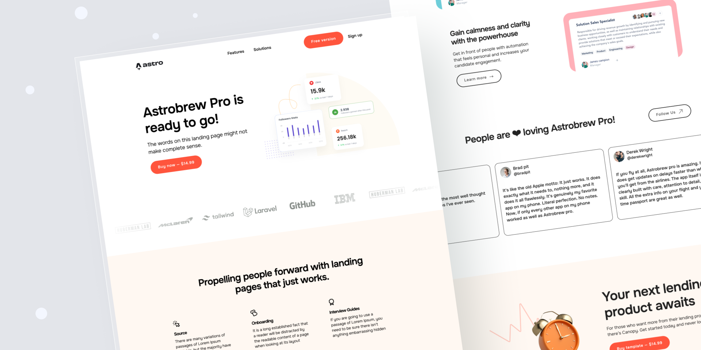

# GameLayer - Gamification API Platform



## 🚀 Project Structure

Inside of your Astro project, you'll see the following folders and files:

```text
/
├── public/
│   └── favicon.svg
├── src/
│   ├── components/
│   │   └── Brands.astro
        └── CallToAction.astro
        └── Features.astro
        └── Footer.astro
        └── Header.astro
        └── hero.astro
        └── Reviews.astro
        └── Showcase.astro
│   ├── layouts/
│   │   └── Layout.astro
│   └── pages/
│       └── index.astro
└── package.json
```

Astro looks for `.astro` or `.md` files in the `src/pages/` directory. Each page is exposed as a route based on its file name.

There's nothing special about `src/components/`, but that's where we like to put any Astro/React/Vue/Svelte/Preact components.

Any static assets, like images, can be placed in the `public/` directory.

You're welcome to rearrange the components within the index.astro file as you see fit


## 🧞 Commands

All commands are run from the root of the project, from a terminal:

| Command                   | Action                                           |
| :------------------------ | :----------------------------------------------- |
| `npm install`             | Installs dependencies                            |
| `npm run dev`             | Starts local dev server at `localhost:4321`      |
| `npm run build`           | Build your production site to `./dist/`          |

## Local performance testing

Test production build performance locally using Lighthouse with realistic compression:

**Terminal 1:**
```bash
npm run perf:run
```

**Terminal 2:**
```bash
npm run perf:lighthouse
```

**Open the report:**
```bash
open lighthouse-report.html
```

This setup:
- Builds the production site to `./dist`
- Serves `./dist` with **gzip + brotli compression** using `sirv-cli` to better approximate production CDN behavior
- Runs Lighthouse audit against the compressed server
- Generates report at `./lighthouse-report.html`
- Displays Performance score and key metrics in the terminal

The Lighthouse script will:
- Check if the performance server is running at `http://localhost:4321/`
- Run a performance audit using headless Chrome
- Generate an HTML report at `./lighthouse-report.html`
- Display the Performance score and key metrics in the terminal

You can override the URL by setting the `URL` environment variable:
```bash
URL=http://localhost:4321/api-docs npm run perf:lighthouse
```

## 🤖 AI Sales Agent API

The project includes an AI chat endpoint for the GameLayer Sales Agent.

**Endpoint:** `/api/chat` (POST)

**Environment Variables:**
- `OPENAI_API_KEY` (required): Your OpenAI API key

**Quick Start:**
1. Create a `.env` file with `OPENAI_API_KEY=sk-your-key-here`
2. Start the dev server: `npm run dev`
3. Test with: `curl -X POST http://localhost:4321/api/chat -H "Content-Type: application/json" -d '{"message":"Hello"}'`

For detailed documentation, see [`docs/ai-agent.md`](./docs/ai-agent.md).


